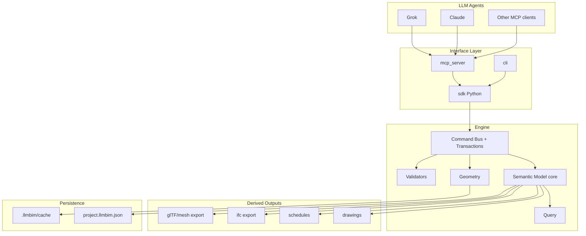

# LLM-BIM Design Document

| Field | Value |
|-------|--------|
| Status | Active |
| Date | 2026-07-15 |
| Authors | Grok (bootstrap); Claude (co-maintain) |
| Repo | `ryanultralife/llm-bim` |

## Overview

**LLM-BIM** is a code-first Building Information Modeling platform operated **only** by LLM agents (Grok, Claude, others) through a deterministic Python API, CLI, and MCP tool surface. There is no interactive drafting UI. The 3D semantic model is the source of truth; plans, sections, elevations, schedules, and sheets are derived artifacts.

MVP proves the thesis: multi-story architectural models (levels, grids, walls, slabs, doors, windows, rooms) created entirely via agent tool calls, with automatic drawings and IFC export.

## Background & Motivation

Traditional BIM tools (Revit, Archicad) are GUI-centric and hostile to agent automation. Agents need:

1. Structured mutations with validation and stable IDs  
2. Rich queries (semantic + spatial)  
3. Deterministic drawing derivation  
4. Interop (IFC)  
5. Headless operation suitable for CI and multi-agent workflows  

Pain point: full Revit parity is multi-year; we ship a sharp architectural MVP and grow disciplines later.

## Goals & Non-Goals

### Goals (MVP)

- Project / building / storey (levels) / grids  
- Walls, floor slabs, doors, windows (hosted), rooms  
- Transactional mutations with undo  
- Plan, section, elevation vector drawings (SVG); simple multi-view sheets (SVG/PDF)  
- Schedules: doors, windows, rooms  
- IFC4 export of MVP elements  
- Python SDK + CLI + MCP server  
- Golden tests: scripted building → model JSON + SVG + IFC snapshots  
- Multi-agent parallel development conventions  

### Non-Goals (MVP)

- Human drafting / CAD frontend (permanent non-goal for product vision unless reopened)  
- Full wall join cleanup / advanced cleanup like Revit  
- Structural framing, foundations, rebar  
- MEP systems, routing, sizing  
- Curtain walls, complex roofs, stairs (post-MVP)  
- Multi-user realtime collab / worksharing  
- Photoreal rendering  
- Code compliance automation (later)  
- Family/type visual editor  

### Later phases (roadmap)

| Phase | Scope |
|-------|--------|
| 2 | Stairs, simple roofs, curtain wall basics; better wall joins |
| 3 | Structural columns/beams + analytical stubs |
| 4 | Light MEP: spaces, ducts/pipes as connected segments (no auto-route genius) |
| 5 | Documentation polish: dimensions, tags, view templates, revisions |
| 6 | IFC round-trip fidelity + federated models |

## Proposed Design

### Architecture



### Design principles

1. **Command pattern only** — every mutation is a typed command with undo inverse.  
2. **Semantic-first geometry** — store parameters (centerline, thickness, height); compute solids on demand.  
3. **IFC-aligned types** — internal types map cleanly to IFC entities; IFC is not the only runtime store.  
4. **Agent-recoverable errors** — structured error codes (`HOST_NOT_FOUND`, `LEVEL_MISMATCH`, …).  
5. **Headless always** — CI can build a whole building and emit drawings with zero display server.

### Geometry strategy

**MVP choice:** pure-Python parametric representation + simple solid construction (extruded polygons, boolean openings via mesh/clip or polyhedral CSG lite).

| Option | Pros | Cons | Decision |
|--------|------|------|----------|
| OpenCascade / CadQuery | Industrial BREP | Heavy native deps, harder on Windows agent envs | Phase 2+ optional backend |
| IfcOpenShell geometry only | IFC-native | Awkward as primary mutator | Use for IFC I/O |
| Pure Python extrusions | Fast install, easy tests | Limited joins/booleans | **MVP default** |

Store:

- Wall: 2D centerline polyline + thickness + base level + height (or top level)  
- Slab: outer polygon + holes + level + thickness  
- Opening/door/window: host wall id + offset along wall + width/height/sill  

Tessellate to triangles only for glTF/clash-lite; drawings use 2D projections of centerlines and cut polygons.

### Semantic model

Core types (conceptual):

```
Project
  units, name, epsg?
  buildings[]
Building
  levels[]  (elevation_mm, name)
  grids[]   (axis U/V, positions)
  elements[] 
Element (base)
  id, category, name, parameters{}, type_id?, level_id?, host_id?
  bbox? (cached)
```

Categories MVP: `wall`, `slab`, `door`, `window`, `room`, `grid`, `level`, `building`, `project`.

Relationships:

- `hosted_by` door/window → wall  
- `bounded_by` room → walls (computed or explicit)  
- `on_level` most elements  

### Transactions

```text
begin() → apply commands → commit() | abort()
undo() / redo() stacks of inverse commands
event_log for agent audit (JSONL optional)
```

Idempotency: optional `client_op_id` on commands; duplicate IDs no-op with same result.

### Drawing derivation

- **Plan:** horizontal cut at level + view range; walls as thickness bands or centerlines+hatch; doors/windows symbols; room labels  
- **Section:** vertical plane cut; hatched cut solids  
- **Elevation:** orthographic façade projection  
- Output: SVG (primary golden), PDF (cairo/svg2pdf or reportlab later)  
- Sheets: title block + placed views (SVG group layout)

### LLM interface

Agents never edit JSON by hand as primary workflow (allowed for debug). Primary path:

```python
from llmbim import Project

p = Project.create(name="Demo")
p.add_level("L1", elevation_mm=0)
p.add_level("L2", elevation_mm=3000)
wid = p.create_wall(level="L1", start=(0, 0), end=(10000, 0), thickness_mm=200, height_mm=3000)
p.place_door(host=wid, offset_mm=2000, width_mm=900, height_mm=2100)
p.export_ifc("out/model.ifc")
p.export_plan("L1", "out/L1_plan.svg")
```

MCP tools mirror SDK methods 1:1 with JSON schemas.

### Persistence

- **Primary:** `project.llmbim.json` (versioned schema `schema_version`)  
- **Cache:** tessellation, spatial index under `.llmbim/` (gitignored)  
- **IFC:** export always; import simple subset post-MVP if needed  

### Validation (agent-callable)

- Orphan hosts  
- Zero-length walls  
- Door wider than wall  
- Level elevation ordering  
- Non-closed room boundaries (warn)  
- Optional AABB clash-lite  

## API / Interface (sketch)

### Python SDK (public)

```python
class Project:
    @classmethod
    def create(cls, name: str, units: str = "mm") -> Project: ...
    @classmethod
    def open(cls, path: str) -> Project: ...
    def save(self, path: str) -> None: ...

    def add_level(self, name: str, elevation_mm: float) -> str: ...
    def add_grid(self, axis: str, positions_mm: list[float]) -> str: ...

    def create_wall(self, *, level: str, start: tuple[float,float], end: tuple[float,float],
                    thickness_mm: float, height_mm: float | None = None,
                    top_level: str | None = None, name: str | None = None) -> str: ...
    def create_slab(self, *, level: str, polygon: list[tuple[float,float]],
                    thickness_mm: float, name: str | None = None) -> str: ...
    def place_door(self, *, host: str, offset_mm: float, width_mm: float,
                   height_mm: float, name: str | None = None) -> str: ...
    def place_window(self, *, host: str, offset_mm: float, width_mm: float,
                     height_mm: float, sill_mm: float, name: str | None = None) -> str: ...
    def create_room(self, *, level: str, name: str, boundary: list[tuple[float,float]] | None = None) -> str: ...

    def query(self, **filters) -> list[ElementView]: ...
    def validate(self) -> list[Issue]: ...

    def export_plan(self, level: str, path: str, **view_opts) -> None: ...
    def export_section(self, p0, p1, path: str, **view_opts) -> None: ...
    def export_elevation(self, direction: str, path: str, **view_opts) -> None: ...
    def export_schedule(self, kind: str, path: str) -> None: ...  # csv/json
    def export_ifc(self, path: str) -> None: ...
    def export_gltf(self, path: str) -> None: ...

    def undo(self) -> None: ...
    def redo(self) -> None: ...
```

### MCP tools (names)

| Tool | Purpose |
|------|---------|
| `project_create` / `project_open` / `project_save` | lifecycle |
| `level_add` / `grid_add` | datum |
| `wall_create` / `slab_create` | structure envelope |
| `door_place` / `window_place` | hosted openings |
| `room_create` | spaces |
| `element_query` / `element_get` / `element_update` / `element_delete` | CRUD |
| `model_validate` | QA |
| `export_plan` / `export_section` / `export_elevation` / `export_sheet` | drawings |
| `export_schedule` / `export_ifc` / `export_gltf` | deliverables |
| `undo` / `redo` | recovery |

All tools return `{ "ok": bool, "result": ..., "error": { "code", "message", "details" } | null }`.

### Error codes (initial)

`NOT_FOUND`, `VALIDATION_FAILED`, `HOST_NOT_FOUND`, `GEOMETRY_DEGENERATE`, `LEVEL_MISMATCH`, `UNIT_ERROR`, `IO_ERROR`, `NOT_IMPLEMENTED`.

## Data Model

JSON sketch:

```json
{
  "schema_version": 1,
  "project": {
    "id": "...",
    "name": "Demo",
    "units": "mm",
    "levels": [
      {"id": "lvl_...", "name": "L1", "elevation_mm": 0}
    ],
    "grids": [],
    "elements": [
      {
        "id": "wal_...",
        "category": "wall",
        "name": "W1",
        "level_id": "lvl_...",
        "params": {
          "start_mm": [0, 0],
          "end_mm": [10000, 0],
          "thickness_mm": 200,
          "height_mm": 3000
        }
      }
    ]
  }
}
```

Migrations: monotonic `schema_version` with upgrade functions in `packages/core/llmbim_core/migrate.py`.

## Repository layout

```text
llm-bim/
  AGENTS.md
  TEAM_STATUS.md
  pyproject.toml
  README.md
  docs/
    DESIGN.md
    PR_PLAN.md
    adrs/
  notes/
    handoffs/
  packages/
    core/          # semantic model, commands, validation
    geometry/      # extrusions, openings, bbox
    drawings/      # plan/section/elevation, svg
    ifc/           # ifcopenshell export
    sdk/           # public llmbim package facade
    mcp_server/    # MCP tools
    cli/           # llmbim CLI
  tests/
    unit/
    golden/
    agent_scripts/
  examples/
```

Python packaging: hatchling or setuptools with optional extras; namespace via re-exports from `llmbim` (sdk).

## Alternatives considered

1. **Blender + Bonsai as host** — fast 3D, poor pure-agent story, human-UI gravity. Rejected for core.  
2. **IFC-as-only-store** — great interop, painful incremental edits and git diffs. Rejected for runtime; keep as export.  
3. **Full OCC from day one** — overkill for MVP agent workflows. Defer.  

## Security & Privacy

- Local-first project files; no network required for core  
- MCP server binds localhost by default  
- No secrets in project JSON  
- Path traversal guards on export paths when server mode enabled  

## Observability

- Structured log lines for each command (`op`, `element_id`, `duration_ms`)  
- `project.stats()` for counts  
- Optional JSONL audit log  

## Testing strategy

- Unit tests per package  
- Golden: `examples/simple_house.py` → committed SVG/JSON hashes  
- Agent simulation: ordered tool-call scripts  
- Property tests for wall length > 0, polygon winding, etc.  

## Risks

| Risk | Severity | Mitigation |
|------|----------|------------|
| Wall join quality poor | Medium | MVP: butt joints; document limits |
| IFC viewer differences | Medium | Test in 2 viewers; keep mapping simple |
| Agent coordinate hallucination | High | Validators + relative placement APIs later |
| Merge conflicts multi-agent | Medium | STATUS claims + ownership matrix |
| Scope creep to Revit parity | High | Ruthless MVP non-goals |

## Key Decisions

1. **No human drafting UI** — product identity; exports only.  
2. **Git-friendly JSON primary store; IFC export** — agent + git workflows.  
3. **Pure-Python parametric geometry for MVP** — portability over BREP power.  
4. **Command bus + transactions** — undo and agent safety.  
5. **SDK / MCP / CLI share one facade** — no divergent behavior.  
6. **Soft package ownership for Grok vs Claude** — parallel speed.  
7. **Drawings are pure functions of model + view params** — reproducibility.  

## Open Questions

1. Default to metric mm only in MVP, or first-class imperial? **Proposal: mm internal, display conversion later.**  
2. Room detection automatic from walls vs explicit polygons? **Proposal: explicit first; auto later.**  
3. MCP transport: stdio only vs HTTP? **Proposal: stdio first.**  

_(Human/agents: resolve in TEAM_STATUS or ADRs.)_

## References

- buildingSMART IFC4  
- IfcOpenShell  
- Speckle / open BIM interchange discussions  
- Model Context Protocol (MCP)  

## PR Plan

See `docs/PR_PLAN.md` (authoritative ordered DAG).
