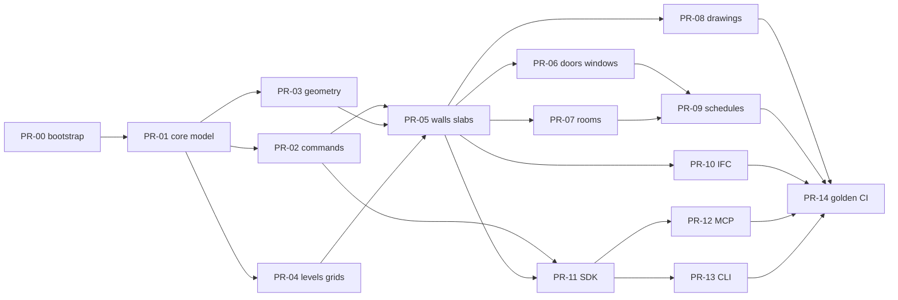

# PR Plan — MVP DAG

Execute in dependency order. Parallelize where no edge exists.  
Update `TEAM_STATUS.md` when claiming.

---

## PR-00: Bootstrap monorepo + agent coordination

- **Owner:** Grok  
- **Depends on:** —  
- **Files:** `AGENTS.md`, `TEAM_STATUS.md`, `README.md`, `pyproject.toml`, `docs/*`, package skeletons, minimal tests  
- **Description:** Empty-repo → installable workspace, design docs, team protocol, `llmbim` placeholder package.  

## PR-01: Core semantic model

- **Owner:** Grok  
- **Depends on:** PR-00  
- **Files:** `packages/core/**`  
- **Description:** `Project`, `Level`, `Element` base, IDs, JSON load/save, schema_version, in-memory store.  

## PR-02: Command bus + transactions + undo

- **Owner:** Grok  
- **Depends on:** PR-01  
- **Files:** `packages/core/llmbim_core/commands/**`, `transactions.py`  
- **Description:** Typed commands, commit/abort, undo/redo, structured errors.  

## PR-03: Geometry primitives

- **Owner:** Grok  
- **Depends on:** PR-01  
- **Files:** `packages/geometry/**`  
- **Description:** Segment/polygon helpers, wall solid extrusion params, opening cut params, AABB.  

## PR-04: Levels + grids API

- **Owner:** Claude (suggested)  
- **Depends on:** PR-01  
- **Files:** `packages/core/.../levels.py`, `grids.py`, tests  
- **Description:** Add/list/reorder levels; orthogonal grids; validation of elevations.  

## PR-05: Walls + slabs

- **Owner:** Claude (suggested)  
- **Depends on:** PR-02, PR-03, PR-04  
- **Files:** core element types + geometry wiring + tests  
- **Description:** Create/update/delete walls and slabs with param validation.  

## PR-06: Hosted doors + windows

- **Owner:** Claude (suggested)  
- **Depends on:** PR-05  
- **Files:** core + geometry openings  
- **Description:** Place openings on wall hosts; offset/width/height/sill checks.  

## PR-07: Rooms / spaces

- **Owner:** either  
- **Depends on:** PR-05  
- **Files:** core rooms, simple area from polygon  
- **Description:** Explicit room boundaries; area schedule fields.  

## PR-08: Drawings (plan / section / elevation)

- **Owner:** Claude (suggested)  
- **Depends on:** PR-05 (better after PR-06/07)  
- **Files:** `packages/drawings/**`  
- **Description:** SVG exporters; view params; golden SVG tests.  

## PR-09: Schedules

- **Owner:** either  
- **Depends on:** PR-06, PR-07  
- **Files:** `packages/drawings` or `packages/core/schedules`  
- **Description:** Door/window/room schedules as CSV/JSON.  

## PR-10: IFC export

- **Owner:** Claude (suggested)  
- **Depends on:** PR-05+ (prefer PR-06/07 too)  
- **Files:** `packages/ifc/**`  
- **Description:** IFC4 export of levels, walls, slabs, openings, spaces via ifcopenshell.  

## PR-11: Public Python SDK

- **Owner:** either  
- **Depends on:** PR-02, PR-05  
- **Files:** `packages/sdk/**`  
- **Description:** Stable `llmbim.Project` facade used by agents and tests.  

## PR-12: MCP server

- **Owner:** either  
- **Depends on:** PR-11  
- **Files:** `packages/mcp_server/**`  
- **Description:** MCP tools 1:1 with SDK; stdio transport.  

## PR-13: CLI

- **Owner:** either  
- **Depends on:** PR-11  
- **Files:** `packages/cli/**`  
- **Description:** `llmbim` commands: create, run script, export, validate.  

## PR-14: Golden house example + CI

- **Owner:** either  
- **Depends on:** PR-08, PR-09, PR-10, PR-12, PR-13  
- **Files:** `examples/`, `tests/golden/`, `.github/workflows/ci.yml`  
- **Description:** End-to-end scripted building; CI on push.  

---

## Parallel waves (suggested)

| Wave | Grok | Claude |
|------|------|--------|
| 0 | PR-00 | Review DESIGN, prepare env |
| 1 | PR-01 | (wait or docs polish) |
| 2 | PR-02 + PR-03 in sequence/parallel | PR-04 |
| 3 | Support / review | PR-05 then PR-06 |
| 4 | PR-07 or PR-11 | PR-08, PR-10 |
| 5 | PR-12 / PR-13 | PR-09 + help PR-14 |
| 6 | PR-14 together | PR-14 together |

---

## Merge rule

`main` must stay green. Prefer stacking: merge PR-01 before starting PR-05.  
If blocked on a dependency, help review the upstream PR instead of forking duplicate types.
